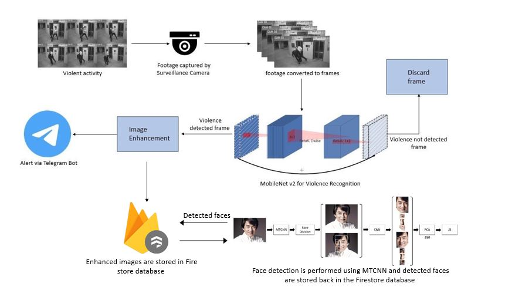

# VigilEyeX: AI-Powered Real-Time Violence Detection System

<div align="center" >
  <h2>Making public spaces safer through intelligent surveillance</h2>
</div>

## Overview

VigilEyeX is an advanced surveillance system that leverages deep learning to detect violent incidents in real-time. By combining MobileNetv2 and LSTM networks, our system efficiently processes video feeds to identify potential security threats, automatically alerting authorities with enhanced imagery and precise location data.

Unlike traditional surveillance systems that require constant human monitoring, VigilEyeX operates autonomously, significantly reducing response times and improving public safety. Our solution is designed to be deployed on cost-effective hardware like Raspberry Pi, making it accessible for schools, campuses, and public facilities.

## Features

- **Real-time Violence Detection**: Processes video streams to identify violent incidents with high accuracy (96%)
- **Comprehensive Web Dashboard**: Monitor and manage the entire system through an intuitive browser interface
- **Multi-Camera Support**: Connect and monitor multiple camera feeds simultaneously
- **User Authentication System**: Secure login with role-based access control for administrators and staff
- **Automated Alert System**: Sends immediate notifications via multiple channels (Telegram, Email, Browser notifications)
- **Face Detection & Enhancement**: Utilizes MTCNN to identify and enhance images of individuals involved
- **Incident Management**: Track, review, and export incident reports with detected faces
- **Database Integration**: Stores all incidents, cameras, and user data in a structured database
- **Optimized for Edge Devices**: Engineered to run efficiently on Raspberry Pi and similar hardware
- **Privacy-Conscious Design**: Option to blur faces of non-involved individuals
- **Comprehensive Logging**: Maintains records of incidents with timestamps and locations for future analysis
- **Low Latency Processing**: Achieves near real-time performance with minimal processing delay

## Architecture

<!-- System architecture diagram would go here -->


Our system employs a two-stage deep learning approach:

1. **Spatial Feature Extraction**: MobileNetv2 processes each video frame to extract visual features
2. **Temporal Analysis**: LSTM networks analyze sequences of frames to detect patterns of violent behavior
3. **Alert Generation**: When violence is detected, the system:
   - Captures and enhances images of the incident
   - Detects and isolates faces of individuals involved
   - Sends alerts through multiple channels (Telegram, Email, Browser notifications)
   - Records the incident in a secure database
4. **Web Interface**: Provides a comprehensive dashboard for:
   - Monitoring live camera feeds
   - Managing cameras and users
   - Reviewing incident history with detected faces
   - Customizing notification settings


<!-- Example of real-time violence detection and alert generation would go here -->

## Installation

### Prerequisites

- Python 3.8+
- TensorFlow 2.15
- OpenCV 4.7.0
- Flask 2.3+
- SQLAlchemy 3.0+
- Raspberry Pi 4 (recommended) or similar hardware

### Quick Start

```bash
# Clone the repository
git clone https://github.com/VigilEyeX-Team/surveillance-system.git
cd vigileyex

# Install dependencies
pip install -r requirements.txt

# Initialize the database
python db_init.py

# Start the web server
python app.py
```

### First Login

The system creates a default administrator account:
- Username: `admin`
- Password: `admin123`

**Important**: Change the default password immediately after first login.

## Web Interface

VigilEyeX includes a comprehensive web interface built with Flask, allowing you to:

### Dashboard
- View all connected cameras in a grid layout
- Monitor the status of each camera feed
- See recent incidents at a glance

### Camera Management
- Add, edit, and remove camera connections
- Adjust camera settings (resolution, FPS)
- View camera health statistics

### Incident Reports
- Browse all detected violent incidents
- View enhanced images and extracted faces
- Mark incidents as reviewed or archived
- Export incident data to CSV

### User Management
- Create and manage user accounts
- Assign administrator or standard user roles
- Track user activity and login history

### Notification Settings
- Configure multiple notification channels
- Customize alert thresholds and frequency
- Test notification delivery

## Usage

### Basic Operation

```bash
# Start the web server on default port (5000)
python app.py

# Specify a different port
python app.py --port=8080

# Enable debug mode
python app.py --debug

# Run in production mode
python app.py --production
```

### Advanced Configuration

VigilEyeX can be extensively customized through the configuration file:

```python
# config.py
DETECTION_THRESHOLD = 0.60        # Violence detection confidence threshold
CONSECUTIVE_FRAMES = 30           # Required consecutive frames for alert
ALERT_COOLDOWN = 60               # Seconds between alerts
FACE_DETECTION_ENABLED = True     # Enable/disable face detection
IMAGE_ENHANCEMENT_LEVEL = 1.3     # Image sharpening factor
DATABASE_URL = 'sqlite:///app.db' # Database connection string
SECRET_KEY = 'your-secret-key'    # Flask secret key (change in production)
```

## API Integration

VigilEyeX provides a RESTful API for integration with other systems:

```bash
# Get system status
curl http://localhost:5000/api/status

# Get list of recent incidents
curl http://localhost:5000/api/incidents

# Get camera status
curl http://localhost:5000/api/cameras
```

## Performance

Our system achieves state-of-the-art performance while maintaining real-time processing capabilities:

| Metric | Value |
|--------|-------|
| Violence Detection Accuracy | 96% |
| False Positive Rate | 4.3% |
| False Negative Rate | 3.7% |
| Processing Speed (Raspberry Pi 4) | 12-15 FPS |
| Processing Speed (Desktop GPU) | 25-30 FPS |
| Alert Generation Latency | <2 seconds |
| Model Size | 24.7 MB |
| RAM Usage | 380-450 MB |
| Web Interface Response Time | <500ms |
| Database Size (1000 incidents) | ~150MB |

## Security Features

VigilEyeX incorporates several security features:

- **Secure Authentication**: Password hashing and protection against brute force attacks
- **CSRF Protection**: Prevention of cross-site request forgery
- **Role-Based Access Control**: Different permission levels for administrators and standard users
- **Session Management**: Automatic timeout of inactive sessions
- **Audit Logging**: Recording of all critical system actions
- **Data Encryption**: Optional encryption for sensitive data storage

## Research and Methodology

Our approach builds upon recent advancements in computer vision and deep learning for violence detection:

1. **Two-Stream Architecture**: We utilize spatial and temporal streams to capture both appearance and motion information
2. **Transfer Learning**: MobileNetv2 pre-trained on ImageNet provides a robust foundation for our spatial feature extraction
3. **Sequence Modeling**: LSTM networks analyze temporal patterns to distinguish between normal and violent activities
4. **Data Augmentation**: Extensive augmentation techniques ensure robustness across lighting conditions and camera angles
5. **Model Optimization**: Quantization and pruning techniques enable deployment on edge devices
6. **Web Technologies**: Flask, SQLAlchemy, and SocketIO for responsive real-time interfaces

## Future Work

We are actively working on several enhancements to the VigilEyeX system:

- **Audio Analysis**: Integrating sound detection for screams and aggressive speech
- **Advanced Face Recognition**: Matching faces across multiple incidents for threat tracking
- **Weapon Detection**: Specialized models to identify potential weapons
- **Crowd Density Analysis**: Detecting unusual crowd movements or gatherings
- **Mobile Application**: Companion app for on-the-go monitoring and alerts
- **Cloud Integration**: Optional cloud backup and processing capabilities

## Deployment Options

VigilEyeX supports various deployment scenarios:

1. **Local Deployment**: Run on a single machine with connected cameras
2. **Distributed Deployment**: Multiple edge devices reporting to central server
3. **Hybrid Cloud**: Edge processing with cloud-based storage and alerts
4. **Docker Containerization**: Easy deployment in containerized environments

## Team

**VigilEyeX** was developed by students at Jaypee University of Information Technology, Waknaghat:

- **Aayush Sharma** (Roll No. 211193)
- **Parth Sharma** (Roll No. 211106)
- **Aditya Singh** (Roll No. 211194)

Under the supervision of **Dr. Rakesh Kanji**, Assistant Professor (SG), Department of Computer Science.

## License

This project is licensed under the MIT License - see the [LICENSE](LICENSE) file for details.

## Acknowledgments

We thank the following open-source projects and research papers that made this work possible:

- MobileNetv2 architecture by Sandler et al.
- MTCNN face detection implementation by Zhang et al.
- The Hockey Fight and Movies datasets for violence detection
- TensorFlow and OpenCV communities for their excellent tools and documentation
- Flask and SQLAlchemy for the web framework and database ORM
- Bootstrap and Socket.IO for the frontend components

## Citation

If you use VigilEyeX in your research or project, please cite:

```
@article{sharma2025vigileyex,
  title={VigilEyeX: An AI-powered system for real-time monitoring and ensuring public safety},
  author={Sharma, Aayush and Sharma, Parth and Singh, Aditya and Kanji, Rakesh},
  institution={Jaypee University of Information Technology},
  year={2025}
}
```
